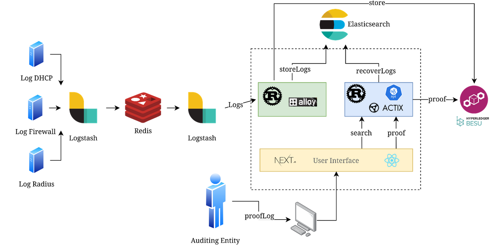

<p align="center">
  
</p>
<h1 align="center">Audita</h1>
<p align="center">
  <strong>Audita</strong> é um sistema de auditoria especializado em rastreamento de acesso à rede, criando trilhas de auditoria imutáveis que identificam quem, quando e como acessou os recursos da rede.<br>
  Construído em Rust com integrações ao Prometheus, ElasticSearch e Ethereum, ele coleta e correlaciona logs críticos de firewall, DHCP e RADIUS, utilizando blockchain como camada de verificação criptográfica para garantir a integridade temporal dos registros de acesso.
</p>

## 📑 Índice

- [🔍 Como Funciona](#-como-funciona)
  - [Fluxo de Acesso à Rede](#fluxo-de-acesso-à-rede)
  - [Logs do Firewall](#logs-do-firewall)
  - [Logs do DHCP](#logs-do-dhcp)
  - [Autenticação via RADIUS](#autenticação-via-radius)
  - [Verificação por Blockchain](#verificação-por-blockchain)
- [🚀 Funcionalidades](#-funcionalidades)
- [✨ Quick Start](#-quick-start)
- [📦 Instalação](#-instalação)
  - [Opção 1: Docker (Recomendado)](#opção-1-docker-recomendado)
  - [Opção 2: Compilar do Código Fonte](#opção-2-compilar-do-código-fonte)
  - [Opção 3: Executar via Binário Pré-compilado](#opção-3-executar-via-binário-pré-compilado)
- [⛓️ Deploy do Contrato](#️-deploy-do-contrato)
- [⚙️ Configuração](#️-configuração)
  - [Formato do Arquivo de Configuração](#formato-do-arquivo-de-configuração)
  - [Variáveis de Ambiente](#variáveis-de-ambiente)
  - [Opções de Configuração](#opções-de-configuração)
- [🎯 Uso Básico](#-uso-básico)
  - [Enviando Logs para a Aplicação](#enviando-logs-para-a-aplicação)
  - [Identificando Quem Estava Logado](#identificando-quem-estava-logado)
  - [Verificação de Integridade](#verificação-de-integridade)
- [🔌 Integração com Coletores de Logs](#-integração-com-coletores-de-logs)

## 🔍 Como Funciona

### Fluxo de Acesso à Rede

O Audita rastreia o fluxo completo de acesso à rede, desde a autenticação do usuário até suas atividades de rede:

1. **Usuário se conecta** → Autenticação via RADIUS
2. **DHCP atribui IP** → Correlação usuário ↔ IP interno
3. **Firewall registra atividade** → Logs de acesso com IP interno
4. **NAT traduz endereços** → Mapeamento IP interno ↔ IP externo
5. **Audita correlaciona** → Identifica quem fez cada acesso

### Logs do Firewall

Os logs de firewall são essenciais para rastrear atividades de rede:

```
{
  "timestamp": "2025-07-14T14:04:33.000Z",
  "dst_ip": "172.21.29.221",
  "dst_mapped_ip": "200.137.65.102",
  "dst_mapped_port": "57738",
  "dst_port": "57738",
  "src_ip": "54.186.142.142",
  "src_mapped_ip": "54.186.142.142",
  "src_mapped_port": "443",
  "src_port": "443",
  "type": "fw"
}
```

O Audita captura e processa esses logs para:

- Rastrear destinos acessados
- Correlacionar com dados de autenticação

### Logs do DHCP

Os logs do DHCP são essenciais para saber o MAC address do IP interno atribuído:

```
{
  "timestamp": "2025-07-14T14:04:26.634814527Z",
  "ip": "172.21.29.221",
  "lease_time": "4000",
  "mac": "58:6c:25:a0:ba:6d",
  "type": "dhcp"
}
```

### Autenticação via RADIUS

O servidor RADIUS fornece a camada de identificação de usuários:

```
{
  "timestamp": "2025-07-14T14:04:26.427588699Z",
  "mac": "58:6c:25:a0:ba:6d",
  "type": "radius",
  "username": "usuario-logado"
}
```

Essa correlação permite que o Audita saiba exatamente:

- Quem está por trás de cada IP interno
- Quando a sessão começou e terminou
- Qual dispositivo está sendo usado

### Verificação por Blockchain

A blockchain atua como uma camada adicional de verificação:

- **Hash dos logs**: Cada lote de logs gera um hash único
- **Timestamp imutável**: Registra quando os logs foram processados
- **Verificação de integridade**: Permite detectar alterações posteriores nos dados
- **Trilha de auditoria**: Cria uma cadeia cronológica verificável

## 🚀 Funcionalidades

- ⚙️ Backend de alta performance em Rust
- 📦 Containerizado via Docker
- 📈 Integração com Prometheus & Grafana
- 🔍 Suporte ao Elasticsearch para logs pesquisáveis
- ⛓️ Pipeline compatível com Ethereum Besu
- 🧩 Arquitetura modular para fácil extensão

## ✨ Quick Start

Este guia rápido demonstra como configurar e usar o sistema Audita para auditoria de logs de rede usando blockchain e Elasticsearch.

## Pré-requisitos

- Docker
- Acesso à internet para baixar as imagens Docker

## 1. Configuração da Infraestrutura

### Criando a Rede Docker

Primeiro, crie uma rede Docker dedicada para os containers do Audita:

```bash
docker network create audita
```

### Iniciando o Elasticsearch

Configure e inicie o Elasticsearch para armazenamento dos logs:

```bash
docker run -d \
  --name elasticsearch \
  --network audita \
  -e "discovery.type=single-node" \
  -e "xpack.security.enabled=true" \
  -e "ELASTIC_PASSWORD=changeme" \
  -p 9200:9200 \
  docker.elastic.co/elasticsearch/elasticsearch:8.15.2
```

**Configurações:**

- `discovery.type=single-node`: Configura o Elasticsearch como nó único
- `xpack.security.enabled=true`: Habilita autenticação
- `ELASTIC_PASSWORD=changeme`: Define a senha do usuário elastic
- Porta `9200`: Interface HTTP do Elasticsearch

### Iniciando o Besu (Blockchain)

Configure e inicie o nó Hyperledger Besu para a blockchain:

```bash
docker run -d \
  --name besu \
  --network audita \
  -e JAVA_OPTS="-XX:-FlightRecorder" \
  -p 8545:8545 \
  hyperledger/besu:25.2.2 \
  --network=dev \
  --rpc-http-cors-origins="all" \
  --rpc-http-enabled \
  --metrics-enabled \
  --metrics-host=0.0.0.0 \
  --host-allowlist="*" \
  --rpc-http-api=ETH,NET,WEB3,DEBUG,TXPOOL \
  --rpc-ws-enabled \
  --rpc-ws-api=ETH,NET,WEB3 \
  --miner-enabled \
  --miner-coinbase="0xfe3b557e8fb62b89f4916b721be55ceb828dbd73" \
  --logging=INFO \
  --rpc-http-max-active-connections=100000 \
  --min-gas-price=0 \
  --tx-pool-max-future-by-sender=1024
```

**Configurações principais:**

- `--network=dev`: Rede de desenvolvimento
- `--rpc-http-enabled`: Habilita RPC HTTP
- `--miner-enabled`: Habilita mineração
- `--min-gas-price=0`: Gas price zero para desenvolvimento
- Porta `8545`: Interface RPC do Besu

## 2. Iniciando o Audita

Configure e inicie o container principal do Audita:

```bash
docker run -d \
  --name audita \
  --network audita \
  -e AUDITA__BATCH_SIZE=1 \
  -e AUDITA__ETHEREUM__URL="http://besu:8545" \
  -e AUDITA__ETHEREUM__PRIVATE_KEY="0x8f2a55949038a9610f50fb23b5883af3b4ecb3c3bb792cbcefbd1542c692be63" \
  -e AUDITA__ELASTIC__URL="http://elasticsearch:9200" \
  -e AUDITA__ELASTIC__USERNAME="elastic" \
  -e AUDITA__ELASTIC__PASSWORD="changeme" \
  -p 8080:8080 \
  ghcr.io/luizfelmach/audita:dev
```

**Configurações:**

- `AUDITA__BATCH_SIZE=1`: Processa um registro por vez
- `AUDITA__ETHEREUM__URL`: Endpoint do Besu
- `AUDITA__ETHEREUM__PRIVATE_KEY`: Chave privada para transações
- `AUDITA__ELASTIC__*`: Credenciais do Elasticsearch
- Porta `8080`: API REST do Audita

## 3. Testando o Sistema

### 3.1. Enviando Logs de Rede

#### Log RADIUS (Autenticação)

```bash
curl -X POST http://localhost:8080/api \
  -H "Content-Type: application/json" \
  -d '{
    "type": "radius",
    "mac": "AA:BB:CC:DD:EE:FF",
    "username": "luiz.f.machado",
    "timestamp": "2025-09-28T14:20:00Z"
  }'
```

#### Log DHCP (Atribuição de IP)

```bash
curl -X POST http://localhost:8080/api \
  -H "Content-Type: application/json" \
  -d '{
    "type": "dhcp",
    "ip": "192.168.0.10",
    "mac": "AA:BB:CC:DD:EE:FF",
    "lease_time": 3600,
    "timestamp": "2025-09-28T14:25:00Z"
  }'
```

#### Log Firewall (Tráfego de Rede)

```bash
curl -X POST http://localhost:8080/api \
  -H "Content-Type: application/json" \
  -d '{
    "type": "fw",
    "dst_ip": "10.0.0.1",
    "dst_port": 443,
    "dst_mapped_ip": "54.186.142.142",
    "dst_mapped_port": 443,
    "src_ip": "192.168.0.10",
    "src_port": 12345,
    "src_mapped_ip": "200.137.65.102",
    "src_mapped_port": 98765,
    "timestamp": "2025-09-28T14:30:00Z"
  }'
```

### 3.2. Consultando Logs por Tipo

#### Auditoria por Firewall

Busca logs de firewall por IP e porta de origem:

```bash
curl -X POST http://localhost:8080/api/auditing/firewall \
  -H "Content-Type: application/json" \
  -d '{
    "ip": "200.137.65.102",
    "port": 98765,
    "timestamp": "2025-09-28T14:30:00Z",
    "delta": 120
  }'
```

**Resposta esperada:**

```json
{
  "documents": [
    {
      "audita_id": "37d6026b-253e-4c4b-86b2-4d9951705066",
      "audita_ord": 0,
      "type": "fw",
      "dst_ip": "10.0.0.1",
      "dst_port": 443,
      "dst_mapped_ip": "54.186.142.142",
      "dst_mapped_port": 443,
      "src_ip": "192.168.0.10",
      "src_port": 12345,
      "src_mapped_ip": "200.137.65.102",
      "src_mapped_port": 98765,
      "timestamp": "2025-09-28T14:30:00Z"
    }
  ]
}
```

#### Auditoria por DHCP

Busca logs DHCP por IP:

```bash
curl -X POST http://localhost:8080/api/auditing/dhcp \
  -H "Content-Type: application/json" \
  -d '{
    "ip": "192.168.0.10",
    "timestamp": "2025-09-28T14:30:00Z",
    "delta": 10
  }'
```

#### Auditoria por RADIUS

Busca logs RADIUS por endereço MAC:

```bash
curl -X POST http://localhost:8080/api/auditing/radius \
  -H "Content-Type: application/json" \
  -d '{
    "mac": "AA:BB:CC:DD:EE:FF",
    "timestamp": "2025-09-28T14:30:00Z",
    "delta": 10
  }'
```

### 3.3. Auditoria Automática Correlacionada

Busca e correlaciona automaticamente logs de firewall, DHCP e RADIUS:

```bash
curl -X POST http://localhost:8080/api/auditing/auto \
  -H "Content-Type: application/json" \
  -d '{
    "ip": "200.137.65.102",
    "port": 98765,
    "timestamp": "2025-09-28T14:30:00Z",
    "delta": 120
  }'
```

**Resposta esperada:**

```json
{
  "firewall": {
    "audita_id": "37d6026b-253e-4c4b-86b2-4d9951705066",
    "type": "fw",
    "src_ip": "192.168.0.10",
    "src_mapped_ip": "200.137.65.102",
    ...
  },
  "dhcp": {
    "audita_id": "04cf3e65-84a7-4408-9d97-c67bb80603f5",
    "type": "dhcp",
    "ip": "192.168.0.10",
    "mac": "AA:BB:CC:DD:EE:FF",
    ...
  },
  "radius": {
    "audita_id": "f6d0bc60-8f3a-4bee-8cca-028f33948f8e",
    "type": "radius",
    "mac": "AA:BB:CC:DD:EE:FF",
    "username": "luiz.f.machado",
    ...
  }
}
```

## 4. Verificação da Integridade na Blockchain

### Consultar Hash do Documento no Storage

Verifica o hash armazenado na blockchain:

```bash
curl -X GET http://localhost:8080/api/storage/hash/37d6026b-253e-4c4b-86b2-4d9951705066
```

**Resposta:**

```json
{
  "id": "37d6026b-253e-4c4b-86b2-4d9951705066",
  "hash": "59d1fed3a97534e6202215f1e50f506c4f609ec6993466a68dce1d316bb7a4e8"
}
```

### Consultar Hash do Documento na Blockchain

Verifica a hash do documento na blockchain:

```bash
curl -X GET http://localhost:8080/api/storage/signer/37d6026b-253e-4c4b-86b2-4d9951705066
```

## 5. Parâmetros da API

### Parâmetros Comuns

- `timestamp`: Momento do evento (formato ISO 8601)
- `delta`: Janela de tempo em segundos para busca (±delta segundos do timestamp)

### Tipos de Log Suportados

1. **RADIUS**: Logs de autenticação
   - `mac`: Endereço MAC do dispositivo
   - `username`: Nome do usuário autenticado

2. **DHCP**: Logs de atribuição de IP
   - `ip`: Endereço IP atribuído
   - `mac`: Endereço MAC do dispositivo
   - `lease_time`: Tempo de concessão em segundos

3. **Firewall**: Logs de tráfego de rede
   - `src_ip`, `src_port`: IP e porta de origem
   - `dst_ip`, `dst_port`: IP e porta de destino
   - `src_mapped_ip`, `src_mapped_port`: IP e porta mapeados de origem (NAT)
   - `dst_mapped_ip`, `dst_mapped_port`: IP e porta mapeados de destino (NAT)

## 6. Limpeza

Para parar e remover todos os containers:

```bash
docker stop audita besu elasticsearch
docker rm audita besu elasticsearch
docker network rm audita
```

## Notas Importantes

- Este setup usa configurações de desenvolvimento - **não use em produção**
- A chave privada Ethereum está hardcoded - substitua por uma segura em produção
- A senha do Elasticsearch deve ser alterada em ambiente produtivo
- O parâmetro `delta` permite buscar eventos em uma janela de tempo ao redor do timestamp especificado

## 📦 Instalação

### Opção 1: Docker (Recomendado)

```bash
docker run ghcr.io/luizfelmach/audita:latest
```

### Opção 2: Compilar do Código Fonte

Pré-requisitos: Rust e Cargo instalados.

```bash
git clone https://github.com/luizfelmach/audita.git
cd audita
cargo build --release
./target/release/audita
```

### Opção 3: Executar via Binário Pré-compilado

1. Baixe o binário mais recente para sua plataforma na [página de Releases](https://github.com/luizfelmach/audita/releases)
2. Torne-o executável:

```bash
chmod +x audita
./audita
```

## ⛓️ Deploy do Contrato

O audita faz automaticamente o deploy do contrato para a blockchain e salva em um arquivo de estado configurado por `AUDITA_STATE` que pode ser alterado o local do arquivo de estado. Por padrão irá ser salvo no path atual. Em container Docker, o arquivo é salvo em /var/lib/audita/state.json. Útil para fazer volume e não perder o deploy do contrato.

O seguinte código é o contrato que o Audita fará deploy:

```solidity

// SPDX-License-Identifier: UNLICENSED
pragma solidity ^0.8.27;

contract Auditability {
    address public owner;

    struct IndexData {
        bytes32 hash;
        bool exists;
    }

    mapping(string => IndexData) private indices;
    event IndexStored(string indexed index, bytes32 hash);

    constructor() {
        owner = msg.sender;
    }

    function store(string memory index, bytes32 hash) public {
        require(!indices[index].exists, "Index already added.");

        indices[index] = IndexData({hash: hash, exists: true});

        emit IndexStored(index, hash);
    }

    function proof(
        string memory index,
        bytes32 hash
    ) public view returns (bool) {
        require(indices[index].exists, "Index not found.");
        return indices[index].hash == hash;
    }

    function exists(string memory index) public view returns (bool) {
        return indices[index].exists;
    }

    function hash(string memory index) public view returns (bytes32) {
        return indices[index].hash;
    }

    modifier onlyOwner() {
        require(msg.sender == owner, "Only owner.");
        _;
    }
}

```

## ⚙️ Configuração

O Audita pode ser configurado através de arquivos de configuração ou variáveis de ambiente. As fontes de configuração são carregadas na seguinte ordem de precedência:

1. `/etc/audita/config.toml` (sistema)
2. `AUDITA_CONFIG` (váriavel de ambiente para alterar o arquivo padrão)
3. Variáveis de ambiente (maior prioridade)

### Formato do Arquivo de Configuração

Crie um arquivo `config.toml` com a seguinte estrutura:

```toml
host = "0.0.0.0"
name = "worker"
port = 8080
queue_size = 8192
batch_size = 5

[ethereum]
url = "http://localhost:8545"
private_key = "0x8f2a55949038a9610f50fb23b5883af3b4ecb3c3bb792cbcefbd1542c692be63"
max_tx_pending = 50

[elastic]
url = "http://localhost:9200"
username = "elastic"
password = "changeme"
indices_pattern = "%Y.%m.%d"
```

### Variáveis de Ambiente

Todas as opções de configuração podem ser sobrescritas usando variáveis de ambiente com o prefixo `AUDITA__`. Para seções de configuração aninhadas, use sublinhados duplos (`__`).

Exemplos:

```bash
export AUDITA__PORT=8080
export AUDITA__HOST="127.0.0.1"
export AUDITA__ETHEREUM__URL="http://localhost:8545"
export AUDITA__ELASTIC__URL="http://localhost:9200"
export AUDITA__ELASTIC__USERNAME="elastic"
```

## 🔌 Integração com Coletores de Logs

O auditalogs é bem extensível, ou seja, você pode usar o coletor de logs de sua preferência. Para isso, basta utilizar configurar que a saída do logs vai ser a chamada HTTP em /api para o correto funcionamento.

Aqui é um exemplo de configuração com arquitetura utilizando Logstash para coleta de logs:

<p align="center">  </p>

Para coleta de LOGS, basta configurar a saída do Logstash para a aplicação, como no exemplo:

```
input {
  # Exemplo: lendo de um arquivo
  file {
    path => "/var/log/meu_app.log"
    start_position => "beginning"
    sincedb_path => "/dev/null"
  }

  # Exemplo: lendo do stdin (para testes)
  # stdin { }
}

filter {
  # Exemplo: parse de JSON caso o log esteja em JSON
  json {
    source => "message"
    remove_field => ["message"]
  }
}

output {
  http {
    # URL da sua aplicação
    url => "http://localhost:8080/api"

    # Método HTTP
    http_method => "post"

    # Content-Type
    format => "json"

    # Campos que serão enviados
    headers => {
      "Content-Type" => "application/json"
    }

    # Transformação opcional dos dados
    # body => '{"log": "%{[@metadata][log]}"}'
  }

  # Para depuração, também podemos logar no stdout
  stdout {
    codec => rubydebug
  }
}
```

### Contribuindo

Contribuições são bem-vindas! Por favor:

1. Fork o repositório
2. Crie uma branch para sua feature (`git checkout -b feature/nova-funcionalidade`)
3. Commit suas mudanças (`git commit -am 'Adiciona nova funcionalidade'`)
4. Push para a branch (`git push origin feature/nova-funcionalidade`)
5. Abra um Pull Request
