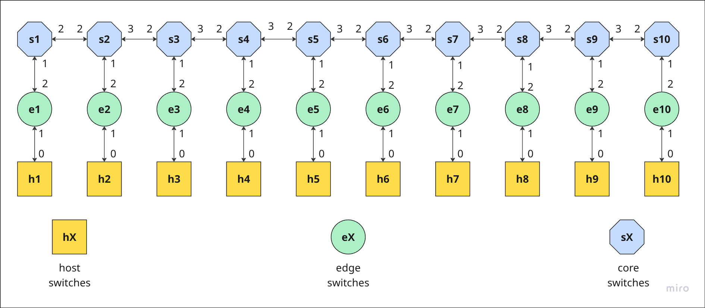

# 🚀 Auditapath

Sistema para auditar caminhos em redes cientes de caminho (path-aware networking) utilizando a tecnologia PolKA. A solução visa assegurar a rastreabilidade e a verificação das rotas através do registro de descritores de caminhos na blockchain e da autenticação por salto, aumentando assim a segurança e a transparência no tráfego da rede.

---

## 🛠️ Instalação (via Docker Compose)

### Requisitos de Sistema (IMPORTANTE)

Este projeto utiliza ferramentas de simulação de rede de baixo nível (Mininet-Wifi, P4) que interagem diretamente com o kernel do Linux.

* **Sistema Operacional Host Obrigatório:** **Linux**
* O projeto **não funcionará** em hosts Windows ou macOS, mesmo utilizando Docker Desktop (WSL 2), pois eles não fornecem o acesso necessário ao kernel que o Mininet-Wifi exige.

### Pré-requisitos

* [Docker](https://docs.docker.com/get-docker/)
* [Docker Compose](https://docs.docker.com/compose/install/) (Integrado ao Docker Desktop)


Este é o método recomendado para executar o projeto. Todas as dependências (P4, Mininet-Wifi, Hardhat, etc.) estão contidas nos serviços Docker.

---
**Importante (Apenas para Linux): Permissões do Docker**

Para executar os comandos `docker` e `docker compose` sem a necessidade de `sudo`, seu usuário precisa pertencer ao grupo `docker`.

1.  Adicione seu usuário ao grupo `docker`:
    ```bash
    sudo usermod -aG docker $USER
    ```

2.  Para que a alteração tenha efeito reinicie o computador.

---
### Passos de Instalação

1.  Clone este repositório:
    ```bash
    git clone [https://github.com/YuriVictoria/auditapath.git](https://github.com/YuriVictoria/auditapath.git)
    cd auditapath
    ```

2.  Construa as imagens Docker:
    ```bash
    docker compose build
    ```
    *(Este comando irá baixar e construir todas as imagens definidas no `docker-compose.yml`.)*

3.  **Inicie os serviços de base:**
    Agora você deve escolher em qual ambiente deseja rodar o projeto.

    **Opção A: Ambiente Local (Blockchain Privada)**
    Este comando sobe um nó local do Hyperledger Besu, faz o deploy do contrato nele e inicia a API local.
    ```bash
    docker compose --profile local up -d
    ```

    **Opção B: Rede Externa (Rede Iliada)**
    Este comando conecta-se à rede Iliada (definida no compose), faz o deploy do contrato nela e inicia a API configurada para esta rede.
    ```bash
    docker compose --profile iliada up -d
    ```

    *(Aguarde alguns instantes até que os containers estejam "saudáveis". Você pode verificar com `docker compose ps`)*

---

## 💻 Utilização (via Docker Compose)

Após ter iniciado um dos perfis acima (Local ou Iliada) e aguardado os serviços estarem saudáveis, você deve iniciar a simulação da rede.

Execute o seguinte comando em seu terminal:

```bash
docker compose run --rm mininet
```

### Topologias de Teste

Uma vez dentro do terminal interativo do mininet, você pode executar as provas de conceito. O projeto inclui duas topologias principais: Linear e Simple

#### 1. Topologia Linear

Tem como objetivo principal o teste da solução para os diferentes cenários de desvio de encaminhamento. Esta topologia é usada para validar os 6 casos de teste:

- Default



- Detour Parcial

- Detour Completo

- Adding (Adição de salto)

- Skipping (Pulo de salto)

- Out-of-Order (Saltos fora de ordem)

#### 2. Topologia Simple

Tem como principal objetivo testar a solução em um cenário mais robusto, com 10 fluxos sendo monitorados simultaneamente, e permitir o teste da troca de rotas.